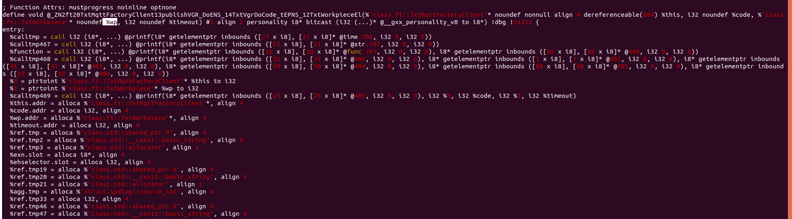

# Everything is logged
## Following 2 passes are combined here - `tfavcigvPass.cpp`

```
LogPasses-new/FAVCIGVT\*/tfavcigvPass.cpp
```
While running `make` it will either create a `publisher` or `subscriber` - check `Makefile`
Variables names are also preserved with the `Makefile` of testbed. only added `-fno-discard-value-names`, following is the cmd,
```
EXECUTEABLE_g++ =  clang++-14 --target=arm-linux-gnueabihf -fno-discard-value-names -flegacy-pass-manager -g -Xclang -load -Xclang /home/raihan/LogPasses-new/FAVCIGVT\*/instrument.so
```
				

**Passes:**
1. This pass prints function names, arguments, values, callInsts, global variables - `longCaller-combined.cpp`
Location: 
```
LogPasses-new/FArVlCIGv-combined
```
run `make clean` and `make` to see the effect.
	
2. To extract `message_arrived()` and `publish` topic use this pass `bothTopicPass.cpp` 

# MQTT programs
Compile publisher/subscriber like following,
```
clang++-14 publisher.cpp -o pub -lpaho-mqttpp3 -lpaho-mqtt3c -lpaho-mqtt3a -lmosquitto
```

Details are here: [MQTT & Mosquitto broker](https://docs.google.com/document/d/1NUTDBS5PnGsBR0BcgSc_4W4UopRmQgS1lQ7VCYrKe7s)
Attack part is here: [Attaking Phase - V1](https://docs.google.com/document/d/1-QIt8StL0lqHEnB287lP3TYZrUJTkYs628ejDZAg5HU)


### Total line of codes
Original file has 597 line of codes. Again,
```
"llvm/ADT/Statistic.h" - 222
"llvm/ADT/SmallVector.h" - 1355
"llvm/Pass.h" - 353
"llvm/IR/Function.h" - 995
"llvm/IR/IRBuilder.h" - 2735
"llvm/IR/LegacyPassManager.h" - 106
"llvm/IR/Module.h" - 1086
"llvm/IR/Attributes.h" - 1280
"llvm/Support/Debug.h" - 105
"llvm/Transforms/IPO/PassManagerBuilder.h" - 217
"llvm/Support/raw_ostream.h" - 789
"llvm/IR/DebugInfoMetadata.h" - 3955
"llvm/ExecutionEngine/ExecutionEngine.h" - 669
"llvm/IR/Type.h" - 528
"llvm/IR/DerivedTypes.h" - 793
"llvm/Support/Timer.h" - 254
```

Total number of lines became 16039
