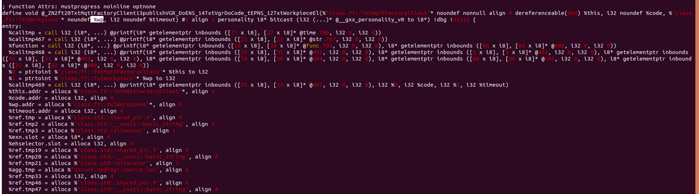
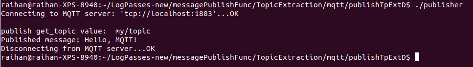
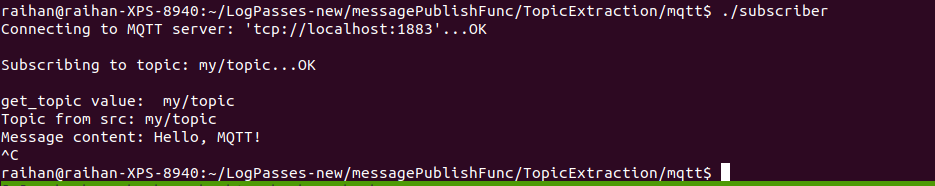

# Log-passes
[Note: Inside the Ubuntu-18 VM this Log-passes is present inside LLVM_passes in home dir]

## These are the most important passes I need, to create a new logging system. 
 - **[Well Functioning] & EVERYTHING LOGGED in this order - Time, function names, arguments, arguments values, callInsts, callInsts values, global variable values** - `tfavcigvPass.cpp`
	```
	LogPasses-new/FAVCIGVT\*/tfavcigvPass.cpp
	```
	Variables names are also preserved with the `Makefile` of testbed. only added `-fno-discard-value-names`, following is the cmd,
	```
	EXECUTEABLE_g++ =  clang++-14 --target=arm-linux-gnueabihf -fno-discard-value-names -flegacy-pass-manager -g -Xclang -load -Xclang /home/raihan/LogPasses-new/FAVCIGVT\*/instrument.so
	```
	

 - **[Well Functioning]** `message_arrived()` and `publish` topic are logged - `bothTopicPass.cpp`
	```
	LogPasses-new/messagePublishFunc/TopicExtraction/mqtt/msgAndPubTopic/bothTopicPass.cpp
	```

 - **[Well Functioning]** `publish` topic extracted from `make_message()` 2nd parameter,  - `topicExtractedpublishPass-v3.cpp`
	```
	LogPasses-new/messagePublishFunc/TopicExtraction/mqtt/publishTpExtD/topicExtractedpublishPass-v3.cpp
	```
	run following cmd at that location to see the effect,
	```
	./client_sub # in 1 terminal
	./publisher # in another terminal
	```
	

	I will see the topic of publiser in that terminal where I ran `./publisher`. The `publish get_topic value:  my/topic` is my instrumentation.

 - **[Well Functioning]**- Topic extracted from `message_arrived()` with following pass, - `topicExtractedtestbedCallInstpass.cpp`
	```
	LogPasses-new/messagePublishFunc/TopicExtraction/mqtt/topicExtractedtestbedCallInstpass.cpp 
	```
	run following cmd at that location to see the effect,
	```
	./subscriber # in 1 terminal
	./publisher # in another terminal
	```
	
	
	I will see the topic printed in the terminal where I ran `./subscriber`. The `get_topic value:  my/topic` is my instrumentation.
	**Check which `basic_string` is used. If it's the testbed code then it should be the generic `basic_string` but if it's the demo code then it should be `c_str` function.**

 - **[Well Functioning]** `Function names, arguments, values, callInsts, callInst values, global variable values` are logged with following pass,
	```
	LogPasses-new/FArVlCIGv-combined/longCaller-combined.cpp
	```

 - **[Well Functioning]** `CallInsts, CallInst values, global variable values` are logged with following pass,
	```
	LogPasses-new/messagePublishFunc/recordCallInst/CallerFromCallInstPass-v6.2.cpp
	# also present in,
	LogPasses-new/FArVlCIGv-combined/CallerFromCallInstPass-v6.2.cpp
	```
 - **[Well Functioning]** `Function names, arguments and values` are logged with following pass,
	```
	LogPasses-new/messagePublishFunc/longPass.cpp
	# also present in 
	LogPasses-new/FArVlCIGv-combined/longPass.cpp
	```

 - The GetFunctions pass will generate only the functions names of any file.
 - The GetFunctions&Values pass will generate all the the function names and values of any file.
 - The Functions&ValuesWithArguments pass will generate all the function names, values and arguments.


Inside messagePublishFunc there is a valueMsgPub.cpp file which is the pass to get the function names, values, arguments and the user function of the function I am checking. Check the folder for details.

## Most important Makefiles
**The `modified.ll` which is the bitcode file of a cpp file. While using the pass the cpp file is modified and the instrumented bitcode or `.ll` file is created. This is shown in following `Makefile`.**
```
LogPasses-new/messagePublishFunc/TopicExtraction/mqtt
```


